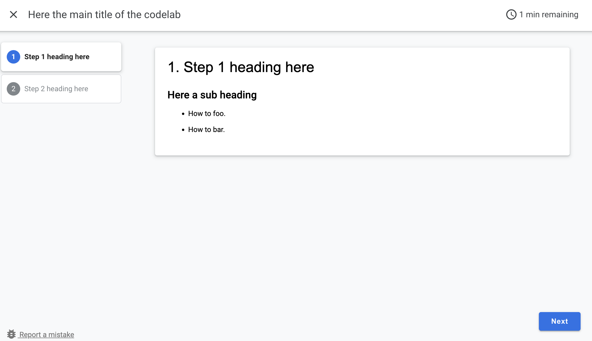

# Codelab Template

This repository provides a template for creating and deploying codelabs using the `claat` tool.

## Content

The main content of the codelab is located in the `codelab.md` file. You can edit this file to customize the codelab according to your needs.

The codelab content is written in CodeLab Markdown format. You can find more information about the CodeLab Markdown format. Here you have an example of a simple [codelab](https://github.com/googlecodelabs/tools/blob/main/sample/codelab.md) whre you can check the format.

The codelab that is located in the `content` folder is a simple example of a codelab that you can use as a starting point:


## Generating the Codelab

This template uses the `claat` tool to generate the codelab pages. To generate the codelab, follow these steps:

1. Install `claat` by running:
```bash
go install github.com/googlecodelabs/tools/claat@latest
```

2. Generate the codelab pages by running:
```bash
claat export content/codelab.md
```

## Deployment to GitHub Pages

This template includes a GitHub Actions workflow for deploying the codelab to GitHub Pages. To enable deployment, you need to enable GitHub Pages deployment from GitHub Actions in the GitHub repository settings.

The deployment workflow is defined in the `publish.yml` file. It will automatically deploy the codelab to GitHub Pages whenever changes are pushed to the `main` branch.

## Contributing

We welcome contributions to the Codelab! To contribute, please follow these steps:

1. Fork the repository.
2. Create a new branch for your feature or bugfix.
3. Make your changes.
4. Submit a pull request with a detailed description of your changes.

## License

This project is licensed under the Apache License 2.0. See the `LICENSE` file for details.